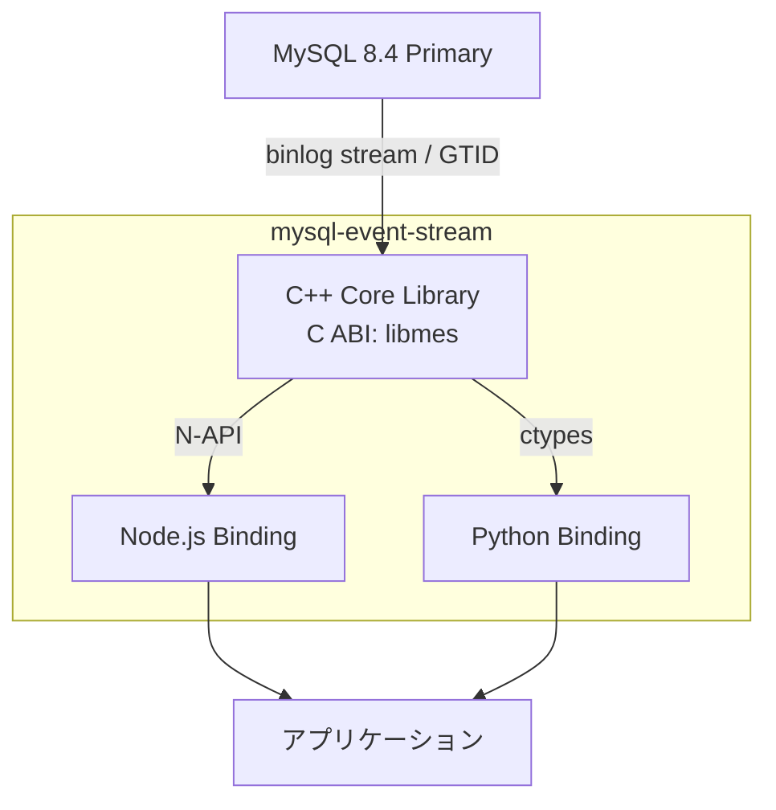

# mysql-event-stream

[](https://github.com/libraz/mysql-event-stream/actions)
[](https://codecov.io/gh/libraz/mysql-event-stream)
[](https://github.com/libraz/mysql-event-stream/blob/main/LICENSE)
[](https://en.cppreference.com/w/cpp/17)

MySQL の binlog レプリケーションイベントをアプリケーション向けのストリーミング API に変換する軽量ライブラリです。

[mygram-db](https://github.com/libraz/mygram-db) のレプリケーション層を独立した CDC (Change Data Capture) エンジンとして切り出したプロジェクトです。

## 概要

mysql-event-stream は MySQL 8.4 のバイナリログイベントをパースし、行レベルの変更イベント (INSERT / UPDATE / DELETE) を構造化データとして出力します。C ABI のコアライブラリに加え、Node.js と Python のバインディングを提供しており、リアルタイムデータパイプライン、監査ログ、キャッシュ無効化、イベント駆動アーキテクチャの構築に利用できます。

## アーキテクチャ



## クイックスタート

### Node.js

```typescript
import { MesEngine } from "@libraz/mysql-event-stream";

const engine = new MesEngine();

// レプリケーションストリームから受信した binlog バイト列を投入
engine.feed(binlogChunk);

while (engine.hasEvents()) {
  const event = engine.nextEvent();
  console.log(event.type, event.database, event.table);
  console.log("before:", event.before);
  console.log("after:", event.after);
}
```

### Python

```python
from mysql_event_stream import MesEngine

engine = MesEngine()

# binlog バイト列を投入
engine.feed(binlog_chunk)

while engine.has_events():
    event = engine.next_event()
    print(event.type, event.database, event.table)
    print("before:", event.before)
    print("after:", event.after)
```

### C API

```c
#include "mes.h"

mes_engine_t* engine = mes_create();
size_t consumed;
mes_feed(engine, data, len, &consumed);

const mes_event_t* event;
while (mes_next_event(engine, &event) == MES_OK) {
    printf("%s.%s: type=%d\n", event->database, event->table, event->type);
}

mes_destroy(engine);
```

### 出力例

`ChangeEvent` にはイベント種別、データベース/テーブル名、binlog 位置、カラム名をキーとした辞書形式の行データが含まれます:

```
-- INSERT INTO items (name, value) VALUES ('Widget', 42)
{
  "type": "INSERT",
  "database": "mes_test",
  "table": "items",
  "before": null,
  "after": { "id": 8, "name": "Widget", "value": 42 },
  "timestamp": 1773584163,
  "position": { "file": "mysql-bin.000003", "offset": 3265 }
}

-- UPDATE items SET value = 100 WHERE name = 'Widget'
{
  "type": "UPDATE",
  "database": "mes_test",
  "table": "items",
  "before": { "id": 8, "name": "Widget", "value": 42 },
  "after": { "id": 8, "name": "Widget", "value": 100 },
  "timestamp": 1773584164,
  "position": { "file": "mysql-bin.000003", "offset": 3611 }
}

-- DELETE FROM items WHERE name = 'Widget'
{
  "type": "DELETE",
  "database": "mes_test",
  "table": "items",
  "before": { "id": 8, "name": "Widget", "value": 100 },
  "after": null,
  "timestamp": 1773584164,
  "position": { "file": "mysql-bin.000003", "offset": 3922 }
}
```

## 特徴

- **軽量** - 最小限の依存関係、小さなバイナリサイズ
- **ストリーミング** - バイト列の到着に応じてインクリメンタルにイベントを処理
- **多言語対応** - C/C++、Node.js (N-API)、Python (ctypes) バインディング
- **MySQL 8.4** - 最新の MySQL LTS リリースに対応
- **GTID サポート** - GTID ベースのレプリケーションに対応した BinlogClient
- **行レベルイベント** - INSERT / UPDATE / DELETE の変更前後のカラム値を完全に取得
- **カラム名解決** - メタデータクエリによる自動カラム名解決
- **辞書形式** - 行データを `Record<string, unknown>` / `dict[str, Any]` で直感的にアクセス

## ビルド

### 前提条件

- CMake 3.20+
- C++17 コンパイラ (GCC 9+ または Clang 10+)
- Node.js 22+ および Yarn (Node.js バインディング用)
- Python 3.11+ (Python バインディング用)

### C++ コア

```bash
cmake -B build -DCMAKE_BUILD_TYPE=Release
cmake --build build --parallel
cd build && ctest --output-on-failure
```

### Node.js バインディング

```bash
cd bindings/node
yarn install
yarn build
yarn test
```

### Python バインディング

```bash
cd bindings/python
pip install -e ".[dev]"
pytest
```

## プロジェクト構成

```
mysql-event-stream/
  core/                        # C++ コアライブラリ
    include/mes.h              #   パブリック C ABI ヘッダ
    src/                       #   実装
  bindings/
    node/                      # Node.js バインディング (N-API アドオン)
    python/                    # Python バインディング (ctypes)
  e2e/                         # E2E テスト (pytest + Docker MySQL 8.4)
```

## 経緯

このプロジェクトは、MySQL レプリケーションを活用したインメモリ全文検索エンジン [mygram-db](https://github.com/libraz/mygram-db) から、binlog パースおよびレプリケーション関連のコンポーネントを抽出したものです。mygram-db が完全な検索サーバーであるのに対し、mysql-event-stream は CDC に特化しており、MySQL の変更イベントストリーミングを任意のアプリケーションに組み込むことができます。

## 要件

**MySQL:**
- バージョン: 8.4
- バイナリログフォーマット: ROW (`binlog_format=ROW`)
- GTID モード有効 (BinlogClient 使用時)
- レプリケーション権限: `REPLICATION SLAVE`, `REPLICATION CLIENT`

## ライセンス

[Apache License 2.0](LICENSE)

## 作者

- libraz
