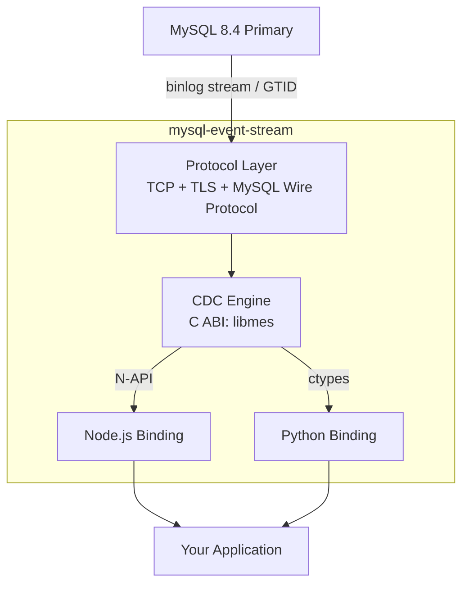

# mysql-event-stream

[](https://github.com/libraz/mysql-event-stream/actions)
[](https://codecov.io/gh/libraz/mysql-event-stream)
[](https://github.com/libraz/mysql-event-stream/blob/main/LICENSE)
[](https://en.cppreference.com/w/cpp/17)

A lightweight library that converts MySQL binlog replication events into a streaming API for applications.

Extracted from [mygram-db](https://github.com/libraz/mygram-db)'s replication layer as a standalone, embeddable CDC (Change Data Capture) engine.

## Overview

mysql-event-stream parses MySQL 8.4 binary log events and emits structured row-level change events (INSERT / UPDATE / DELETE). It provides a C ABI core with first-class bindings for Node.js and Python, making it easy to build real-time data pipelines, audit logs, cache invalidation, and event-driven architectures on top of MySQL.

## Architecture



## Quick Start

### Node.js

```typescript
import { MesEngine } from "@libraz/mysql-event-stream";

const engine = new MesEngine();

// Feed raw binlog bytes from your replication stream
engine.feed(binlogChunk);

while (engine.hasEvents()) {
  const event = engine.nextEvent();
  console.log(event.type, event.database, event.table);
  console.log("before:", event.before);
  console.log("after:", event.after);
}
```

### Python

```python
from mysql_event_stream import MesEngine

engine = MesEngine()

# Feed raw binlog bytes
engine.feed(binlog_chunk)

while engine.has_events():
    event = engine.next_event()
    print(event.type, event.database, event.table)
    print("before:", event.before)
    print("after:", event.after)
```

### C API

```c
#include "mes.h"

mes_engine_t* engine = mes_create();
size_t consumed;
mes_feed(engine, data, len, &consumed);

const mes_event_t* event;
while (mes_next_event(engine, &event) == MES_OK) {
    printf("%s.%s: type=%d\n", event->database, event->table, event->type);
}

mes_destroy(engine);
```

### Example Output

Each `ChangeEvent` contains the event type, database/table name, binlog position, and row data as a plain dictionary keyed by column name:

```
-- INSERT INTO items (name, value) VALUES ('Widget', 42)
{
  "type": "INSERT",
  "database": "mes_test",
  "table": "items",
  "before": null,
  "after": { "id": 8, "name": "Widget", "value": 42 },
  "timestamp": 1773584163,
  "position": { "file": "mysql-bin.000003", "offset": 3265 }
}

-- UPDATE items SET value = 100 WHERE name = 'Widget'
{
  "type": "UPDATE",
  "database": "mes_test",
  "table": "items",
  "before": { "id": 8, "name": "Widget", "value": 42 },
  "after": { "id": 8, "name": "Widget", "value": 100 },
  "timestamp": 1773584164,
  "position": { "file": "mysql-bin.000003", "offset": 3611 }
}

-- DELETE FROM items WHERE name = 'Widget'
{
  "type": "DELETE",
  "database": "mes_test",
  "table": "items",
  "before": { "id": 8, "name": "Widget", "value": 100 },
  "after": null,
  "timestamp": 1773584164,
  "position": { "file": "mysql-bin.000003", "offset": 3922 }
}
```

## Features

- **Lightweight** - No external MySQL client library dependency, small binary size
- **Zero native dependencies** - Ships as a self-contained binary; no libmysqlclient required (only OpenSSL)
- **Streaming** - Process events incrementally as bytes arrive
- **Multi-language** - C/C++, Node.js (N-API), and Python (ctypes) bindings
- **MySQL 8.4** - Built for the latest MySQL LTS release
- **GTID support** - Native BinlogClient with GTID-based replication
- **Row-level events** - Full before/after column values for INSERT, UPDATE, DELETE
- **Column Names** - Automatic column name resolution via metadata queries
- **Dict-based** - Row data as `Record<string, unknown>` / `dict[str, Any]` for intuitive access
- **SSL/TLS** - Full SSL/TLS support for secure MySQL connections
- **Auto-reconnection** - Automatic reconnection with linear backoff on connection loss
- **Backpressure** - Internal reader thread with bounded event queue (default 10,000) prevents stream disconnection during consumer slowdowns
- **Table filtering** - Include/exclude databases and tables to reduce processing overhead
- **Structured logging** - Callback-based structured logging (event=name key=value format)
- **Graceful shutdown** - Thread-safe stream cancellation via `stop()` -- immediately unblocks consumer and reader threads

## Configuration

### SSL/TLS

```typescript
// Node.js
const stream = new CdcStream({
  host: "mysql.example.com",
  user: "replicator",
  password: "secret",
  sslMode: 2,  // 0=disabled, 1=preferred, 2=required, 3=verify_ca, 4=verify_identity
  sslCa: "/path/to/ca.pem",
});
```

```python
# Python
stream = CdcStream(
    host="mysql.example.com",
    user="replicator",
    password="secret",
    ssl_mode=2,
    ssl_ca="/path/to/ca.pem",
)
```

### Table Filtering

```typescript
// Node.js - only process events from specific tables
const engine = new CdcEngine();
engine.setIncludeDatabases(["mydb"]);
engine.setExcludeTables(["mydb.audit_log"]);
```

```python
# Python
engine = CdcEngine()
engine.set_include_databases(["mydb"])
engine.set_exclude_tables(["mydb.audit_log"])
```

### Backpressure Control

```typescript
// BinlogClient uses an internal reader thread with a bounded event queue.
// Default queue size: 10,000 events.
// When the queue is full, TCP backpressure naturally throttles the server.
const stream = new CdcStream({
  host: "mysql.example.com",
  user: "replicator",
  password: "secret",
  maxQueueSize: 5000,  // Configure queue size (default: 10000)
});
```

### Logging

```c
// C API - structured log callback
void my_log(mes_log_level_t level, const char* message, void* userdata) {
    fprintf(stderr, "[%d] %s\n", level, message);
    // Output: [2] event=mysql_connected host=127.0.0.1 port=3306
}
mes_set_log_callback(my_log, MES_LOG_INFO, NULL);
```

### Auto-Reconnection

```typescript
// Node.js - automatic reconnection with linear backoff (1s, 2s, ... 10s cap)
const stream = new CdcStream({
  host: "mysql.example.com",
  user: "replicator",
  maxReconnectAttempts: 10,  // default: 10, 0 = disabled
});
```

## Installation

### Prerequisites

- CMake 3.20+
- C++17 compiler (GCC 9+ or Clang 10+)
- OpenSSL development libraries

```bash
# macOS
brew install cmake openssl

# Ubuntu / Debian
sudo apt install cmake build-essential libssl-dev pkg-config

# Clone
git clone https://github.com/libraz/mysql-event-stream.git
cd mysql-event-stream
```

### C++ Core

```bash
make build
make test

# Optional: install libmes and mes.h for C/C++ projects
sudo make install
sudo make uninstall
```

### Node.js Binding

Requires Node.js 22+ and Yarn.

```bash
cd bindings/node
yarn install
yarn build
yarn test
```

### Python Binding

Requires Python 3.11+.

```bash
cd bindings/python

# With Rye
rye sync
rye run pytest

# With pip
pip install -e ".[dev]"
pytest
```

## Project Structure

```
mysql-event-stream/
  core/                        # C++ core library
    include/mes.h              #   Public C ABI header
    src/
      protocol/                #   MySQL wire protocol (TCP, TLS, auth, query, binlog)
      client/                  #   BinlogClient, EventQueue, ConnectionValidator
    tests/                     #   Unit tests (Google Test)
      e2e/                     #   E2E tests (Docker MySQL 8.4)
  bindings/
    node/                      # Node.js binding (N-API addon)
    python/                    # Python binding (ctypes)
  e2e/
    docker/                    # Docker Compose + MySQL init + SSL certs
```

## Origin

This project extracts the binlog parsing and replication components from [mygram-db](https://github.com/libraz/mygram-db), an in-memory full-text search engine with MySQL replication. While mygram-db is a complete search server, mysql-event-stream focuses solely on CDC - making it easy to embed MySQL change event streaming into any application.

## Requirements

**MySQL:**
- Version: 8.4
- Binary log format: ROW (`binlog_format=ROW`)
- GTID mode enabled (for BinlogClient)
- Replication privileges: `REPLICATION SLAVE`, `REPLICATION CLIENT`

## License

[Apache License 2.0](LICENSE)

## Author

- libraz
