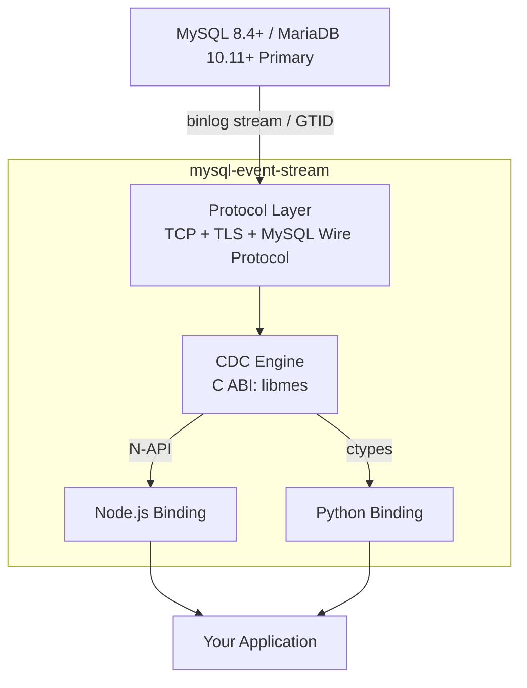

# mysql-event-stream

[](https://github.com/libraz/mysql-event-stream/actions)
[](https://github.com/libraz/mysql-event-stream/releases)
[](https://www.npmjs.com/package/@libraz/mysql-event-stream)
[](https://pypi.org/project/mysql-event-stream/)
[](https://codecov.io/gh/libraz/mysql-event-stream)
[](https://github.com/libraz/mysql-event-stream/blob/main/LICENSE)
[](https://en.cppreference.com/w/cpp/17)
[](https://dev.mysql.com/)
[](https://mariadb.org/)
[](https://github.com/libraz/mysql-event-stream)

A lightweight library that converts MySQL / MariaDB binlog replication events into a streaming API for applications.

Extracted from [mygram-db](https://github.com/libraz/mygram-db)'s replication layer as a standalone, embeddable CDC (Change Data Capture) engine.

## Overview

mysql-event-stream parses MySQL 8.4+ and MariaDB 10.11+ binary log events and emits structured row-level change events (INSERT / UPDATE / DELETE). It provides a C ABI core with first-class bindings for Node.js and Python, making it easy to build real-time data pipelines, audit logs, cache invalidation, and event-driven architectures on top of MySQL or MariaDB.

## Architecture


```mermaid
graph TD
    MySQL[MySQL 8.4+ / MariaDB 10.11+ Primary] -->|binlog stream / GTID| Proto

    subgraph mysql-event-stream
        Proto[Protocol Layer\nTCP + TLS + MySQL Wire Protocol] --> Core[CDC Engine\nC ABI: libmes]
        Core -->|N-API| Node[Node.js Binding]
        Core -->|ctypes| Python[Python Binding]
    end

    Node --> App[Your Application]
    Python --> App
```

## Quick Start

### Node.js

```typescript
import { CdcEngine } from "@libraz/mysql-event-stream";

const engine = new CdcEngine();

// Feed raw binlog bytes from your replication stream. feed() stops early once
// the event queue is full, so drain the queue and re-feed the unconsumed tail.
let offset = 0;
while (offset < binlogChunk.length) {
  const consumed = engine.feed(binlogChunk.subarray(offset));
  offset += consumed;

  while (engine.hasEvents()) {
    const event = engine.nextEvent();
    if (event === null) break;
    console.log(event.type, event.database, event.table);
    console.log("before:", event.before);
    console.log("after:", event.after);
  }

  // Nothing consumed and nothing left to drain: the tail is a partial event.
  // Retain binlogChunk.subarray(offset) and prepend it to the next chunk.
  if (consumed === 0) break;
}

engine.destroy();
```

### Python

```python
from mysql_event_stream import CdcEngine

engine = CdcEngine()

# Feed raw binlog bytes. feed() stops early once the event queue is full, so
# drain the queue and re-feed the unconsumed tail.
offset = 0
while offset < len(binlog_chunk):
    consumed = engine.feed(binlog_chunk[offset:])
    offset += consumed

    while engine.has_events():
        event = engine.next_event()
        if event is None:
            break
        print(event.type, event.database, event.table)
        print("before:", event.before)
        print("after:", event.after)

    if consumed == 0:
        # Partial event at the tail: retain binlog_chunk[offset:] and prepend
        # it to the next chunk.
        break

engine.close()
```

### C API

```c
#include "mes.h"

mes_engine_t* engine = mes_create();
size_t offset = 0;
while (offset < len) {
    size_t consumed = 0;
    if (mes_feed(engine, data + offset, len - offset, &consumed) != MES_OK) {
        /* call mes_reset(), then drain already decoded events */
        break;
    }
    offset += consumed;

    const mes_event_t* event;
    while (mes_next_event(engine, &event) == MES_OK) {
        printf("%s.%s: type=%d\n", event->database, event->table, event->type);
    }

    /* Nothing consumed and nothing left to drain: the tail is a partial event.
       Retain data + offset through data + len and re-feed it with the next
       chunk. Never re-feed from offset 0. */
    if (consumed == 0) break;
}

mes_destroy(engine);
```

### Example Output

Each `ChangeEvent` contains the event type, database/table name, binlog position, and row data as a plain dictionary keyed by column name:

```
-- INSERT INTO items (name, value) VALUES ('Widget', 42)
{
  "type": "INSERT",
  "database": "mes_test",
  "table": "items",
  "before": null,
  "after": { "id": 8, "name": "Widget", "value": 42 },
  "timestamp": 1773584163,
  "position": { "file": "mysql-bin.000003", "offset": 3265 },
  "namesResolved": true
}

-- UPDATE items SET value = 100 WHERE name = 'Widget'
{
  "type": "UPDATE",
  "database": "mes_test",
  "table": "items",
  "before": { "id": 8, "name": "Widget", "value": 42 },
  "after": { "id": 8, "name": "Widget", "value": 100 },
  "timestamp": 1773584164,
  "position": { "file": "mysql-bin.000003", "offset": 3611 },
  "namesResolved": true
}

-- DELETE FROM items WHERE name = 'Widget'
{
  "type": "DELETE",
  "database": "mes_test",
  "table": "items",
  "before": { "id": 8, "name": "Widget", "value": 100 },
  "after": null,
  "timestamp": 1773584164,
  "position": { "file": "mysql-bin.000003", "offset": 3922 }
}
```

## Features

- **Lightweight** - No external MySQL client library dependency, small binary size
- **Self-contained packages** - No libmysqlclient dependency; release artifacts statically link OpenSSL and zlib
- **Streaming** - Process events incrementally as bytes arrive
- **Multi-language** - C/C++, Node.js (N-API), and Python (ctypes) bindings
- **MySQL 8.4+** - Supports LTS and Innovation releases
- **MariaDB 10.11+** - MariaDB-flavor binlog protocol, GTID (`domain-server-seq`), ANNOTATE_ROWS SQL (`sourceSql` / `source_sql`), and slave capability negotiation
- **GTID support** - Native BinlogClient with GTID-based replication (both MySQL and MariaDB formats)
- **Row-level events** - Full before/after column values for INSERT, UPDATE, DELETE
- **VECTOR type** - Native support for MySQL 9.0+ VECTOR columns (decoded as raw bytes)
- **Column Names** - Automatic resolution with `binlog_row_metadata=FULL` or a metadata connection that has `SELECT`; `CdcStream` opens that connection itself, `CdcEngine` takes it from an explicit call
- **Dict-based** - Row data as `Record<string, unknown>` / `dict[str, Any]` for intuitive access
- **SSL/TLS** - Full SSL/TLS support for secure MySQL connections
- **Auto-reconnection** - Automatic reconnection with jittered linear backoff on connection loss
- **Backpressure** - Internal reader thread with bounded event queue (default 10,000) prevents stream disconnection during consumer slowdowns
- **Table filtering** - Include/exclude databases and tables to reduce processing overhead
- **Structured logging** - Callback-based structured logging (event=name key=value format)
- **Graceful shutdown** - `BinlogClient.stop()` is callable from any thread and immediately unblocks the consumer and reader threads; `CdcStream` cancels through `close()` on the task that owns it

## Configuration

### SSL/TLS

```typescript
// Node.js
const stream = new CdcStream({
  host: "mysql.example.com",
  user: "replicator",
  password: "secret",
  sslMode: 4,  // 0=disabled, 1=preferred, 2=required, 3=verify_ca, 4=verify_identity
  sslCa: "/path/to/ca.pem",
});
```

```python
# Python
stream = CdcStream(
    host="mysql.example.com",
    user="replicator",
    password="secret",
    ssl_mode=4,
    ssl_ca="/path/to/ca.pem",
)
```

`preferred` and `required` encrypt the connection but do not authenticate the
server certificate. Use `verify_ca` or `verify_identity` with a CA bundle (or
the OS trust store) for production credentials.

### Authentication plugins

The native client supports MySQL's `caching_sha2_password` and
`mysql_native_password` plugins. A server-requested plugin outside this list
fails with an authentication error rather than silently falling back.

`caching_sha2_password` is the default on MySQL 8.4+ and the only option on 9.x.
When the server's password cache is cold — a fresh user, a server restart, or
`FLUSH PRIVILEGES` — the plugin falls back to *full authentication*, which needs
one of two things:

- `sslMode` / `ssl_mode` of `3` (`verify_ca`) or `4` (`verify_identity`), so the
  password travels over a TLS session whose certificate has been verified; or
- `allowPublicKeyRetrieval` / `allow_public_key_retrieval`, which opts into
  fetching the server's RSA public key over the current channel and encrypting
  the password with it.

`preferred` (`1`) and `required` (`2`) are **not** sufficient: they encrypt the
channel without authenticating the server, so a MITM could collect the cleartext
password. Full authentication under those modes without
`allowPublicKeyRetrieval` fails with an authentication error naming both
remedies. Verified TLS is the recommended one, because the public-key retrieval
opt-in trusts a key that has not itself been authenticated.

### Column names

With `binlog_row_metadata=FULL` the server puts column names in the
`TABLE_MAP` event and nothing else is needed. Otherwise the names come from a
separate connection that runs `SHOW COLUMNS`, and each surface opens it
differently. `CdcStream` opens it from the stream's own connection settings, so
a stream needs no extra call. `CdcEngine` does not: a caller feeding bytes to an
engine enables the connection explicitly.

```typescript
// Node.js
const engine = new CdcEngine();
engine.enableMetadata({
  host: "mysql.example.com",
  user: "replicator",
  password: "secret",
  readTimeoutS: 30,
});
```

```python
# Python
engine = CdcEngine()
engine.enable_metadata(
    host="mysql.example.com",
    user="replicator",
    password="secret",
    read_timeout_s=30,
)
```

The credentials need `SELECT` on the tables being streamed. `TABLE_MAP`
processing then runs `SHOW COLUMNS` synchronously, bounded by
`readTimeoutS` / `read_timeout_s` — `0` delegates the bound to the operating
system and can block indefinitely. A timeout leaves that one event's names
unresolved and the connection is retried once, so check `namesResolved` /
`names_resolved` on every event rather than assuming resolution succeeded.

The connection reads the server's schema as it is now, not as it was at the
binlog position being decoded. Names are authoritative only while consuming at
the current head; for replay from an older position, use
`binlog_row_metadata=FULL` and keep the original `TABLE_MAP` metadata.

### Table Filtering

```typescript
// Node.js - only process events from specific tables
const stream = new CdcStream({
  host: "mysql.example.com",
  includeDatabases: ["mydb"],
  excludeTables: ["mydb.audit_log"],
});
```

```python
# Python
stream = CdcStream(
    host="mysql.example.com",
    include_databases=["mydb"],
    exclude_tables=["mydb.audit_log"],
)
```

Filters are case-sensitive. The table filters — `includeTables` /
`include_tables` and `excludeTables` / `exclude_tables` — take an exact
`database.table` or bare table name, and a trailing `*` is also supported as a
prefix wildcard (for example, `mydb.audit_*` or `orders_*`). A `*` anywhere else
is literal. The database filter `includeDatabases` / `include_databases`
compares the database name byte for byte and has no wildcard form, so
`shard_*` matches a database of exactly that name and nothing else; list every
database you want instead. MySQL
identifier case rules can differ by server platform, so use names emitted by the
source server. If configured include filters see TABLE_MAP events but match
none, the log callback receives one `include_filter_matched_nothing` WARN at
reset or stream close.

### Backpressure Control

```typescript
// BinlogClient uses an internal reader thread with a bounded event queue.
// Default queue size: 10,000 events.
// When the queue is full, TCP backpressure naturally throttles the server.
const stream = new CdcStream({
  host: "mysql.example.com",
  user: "replicator",
  password: "secret",
  maxQueueSize: 5000,  // Configure queue size (default: 10000)
});
```

### Thread Safety

`CdcEngine` instances are single-owner objects. Do not call `feed()`,
`nextEvent()`, `reset()`, or filter/configuration methods concurrently on the
same engine instance. Use one engine per thread/task or serialize access
externally.

`BinlogClient` / `CdcStream` use an internal reader thread. Polling/iteration and
connection lifecycle calls are single-owner operations. `BinlogClient.stop()` is
the any-thread cancellation path and may be called from another thread to unblock
a pending `poll()`. `CdcStream` has no `stop` method: cancel it with `close()`
from the task that owns the stream, which interrupts the native poll first and
then finalizes the iterator.

### Logging

```c
// C API - structured log callback
void my_log(mes_log_level_t level, const char* message, void* userdata) {
    fprintf(stderr, "[%d] %s\n", level, message);
    // Output: [2] event=mysql_connected host=127.0.0.1 port=3306
}
mes_set_log_callback(my_log, MES_LOG_INFO, NULL);
```

### Auto-Reconnection

```typescript
// Node.js - automatic reconnection with linear backoff: attempt N waits a base
// of min(N seconds, 10s), multiplied by 50-100% jitter (so 0.5-1s, 1-2s, ...,
// 5-10s once the cap is reached). The Python binding uses the same schedule.
const stream = new CdcStream({
  host: "mysql.example.com",
  user: "replicator",
  maxReconnectAttempts: 10,  // default: 10, 0 = disabled
});
```

### Resuming from a checkpoint

A stream started without a checkpoint begins at the server's current position,
so every change committed while the process was down is skipped. To pick up
where the last run stopped, read the committed GTID from the stream and pass it
back as the start position on the next run.

```typescript
// Node.js
const stream = new CdcStream({
  host: "mysql.example.com",
  user: "replicator",
  password: "secret",
  startGtid: loadCheckpoint(),  // omit to start at the server's current position
});

try {
  for await (const event of stream) {
    await handle(event);
    saveCheckpoint(stream.currentGtid);
  }
} finally {
  await stream.close();
}
```

```python
# Python
async def run():
    async with CdcStream(
        host="mysql.example.com",
        user="replicator",
        password="secret",
        start_gtid=load_checkpoint(),  # omit to start at the server's current position
    ) as stream:
        async for event in stream:
            await handle(event)
            save_checkpoint(stream.current_gtid)
```

`currentGtid` / `current_gtid` is the last checkpoint the reader committed, and
it survives the scope that closed the stream, so the value can also be persisted
once after the loop. Delivery is at-least-once: an event can be redelivered
after a reconnect, so persist a checkpoint only once your own processing of that
event has succeeded, and make that processing idempotent.

`BinlogClient` carries the same pair under the same names. A GTID the server has
already purged fails with code 405 rather than silently restarting from the
head, so treat that as a signal to take a fresh snapshot.

## Error codes

Native errors expose a stable numeric `mes_error_t` code. Node errors carry it
as `error.code` with `MesErrorCode`; Python exceptions carry `.code` with the
same values and export `MesErrorCode`. Use the code, not message text, for
retry decisions.

| Codes | Meaning | Retry guidance |
| --- | --- | --- |
| 1–2 | Invalid API argument | Fix configuration; do not retry |
| 100–101 | Parse or checksum failure | Reset/reconnect only after diagnosing the input |
| 200–202 | Row decode failure | Do not retry unchanged input |
| 301 (event queue) | Client event queue byte or event budget exceeded | Raise `maxQueueBytes` / `max_queue_bytes`; do not retry unchanged input |
| 301 (query result) | A server query the client runs — configuration validation, GTID lookup, or column metadata — retained more than 100,000 rows or 64 MiB | The caps are compile-time constants with no configuration knob, and the failure closes the connection; reconnect before querying again |
| 400–401 | Connection or authentication failure | Retry only transient connection failures; fix credentials for 401 |
| 402 | Server configuration validation failure | Fix the server configuration; do not retry |
| 403–404 | Stream transport ended | Reconnect from the persisted checkpoint (see [Resuming from a checkpoint](#resuming-from-a-checkpoint)) |
| 405 | Requested GTID was purged | Choose a new recovery/snapshot point; do not retry |

Five further values are exported on `MesErrorCode` and reach no caller as an
error. `NoEvent` (300) is how the native layer reports an empty queue; both
bindings translate it to `null` / `None` from `nextEvent()` / `next_event()`.
`Internal` (99), `Decode` (200), `DecodeColumn` (201) and
`GtidTaggedUnsupported` (406) are retained for ABI stability and have no
producer in the current core — a row decode failure is reported as `DecodeRow`
(202).

The C ABI `mes_error_string()` returns the canonical short description for a
numeric code.

## Installation

### Package installs

```bash
npm install @libraz/mysql-event-stream
pip install mysql-event-stream
```

The Python package publishes platform wheels. The npm package does not select
an addon through optional platform dependencies; build the Node binding from
source below when its bundled addon is not compatible with your runtime.

### Prerequisites

- CMake 3.20+
- C++17 compiler (GCC 9+ or Clang 10+)
- OpenSSL development libraries
- zlib development libraries
- macOS 15.0+ for macOS prebuilt packages (Linux is recommended for servers)

```bash
# macOS
brew install cmake openssl zlib

# Ubuntu / Debian
sudo apt install cmake build-essential libssl-dev zlib1g-dev pkg-config

# Clone
git clone https://github.com/libraz/mysql-event-stream.git
cd mysql-event-stream
```

### C++ Core

```bash
make build
make test

# Optional: install libmes and mes.h for C/C++ projects
sudo make install
sudo make uninstall
```

### Node.js Binding

Requires Node.js 22+ and Yarn.

```bash
cd bindings/node
yarn install
yarn build
yarn test
```

### Python Binding

Requires Python 3.11+. The binding is managed with [Rye](https://rye.astral.sh/);
`requirements.lock` / `requirements-dev.lock` are the source of truth for the
development environment.

```bash
cd bindings/python
rye sync
rye run pytest
```

## Project Structure

```
mysql-event-stream/
  core/                        # C++ core library
    include/mes.h              #   Public C ABI header
    src/
      protocol/                #   MySQL wire protocol (TCP, TLS, auth, query, binlog)
      client/                  #   BinlogClient, EventQueue, ConnectionValidator
    tests/                     #   Unit tests (Google Test)
      e2e/                     #   E2E tests (Docker MySQL 8.4+)
  bindings/
    node/                      # Node.js binding (N-API addon)
    python/                    # Python binding (ctypes)
  e2e/
    docker/                    # Docker Compose + MySQL init + SSL certs
```

## Origin

This project extracts the binlog parsing and replication components from [mygram-db](https://github.com/libraz/mygram-db), an in-memory full-text search engine with MySQL replication. While mygram-db is a complete search server, mysql-event-stream focuses solely on CDC - making it easy to embed MySQL change event streaming into any application.

## Requirements

**MySQL:**
- Version: 8.4+ (LTS and Innovation releases)
- GTID mode enabled (for BinlogClient)
- Replication privileges: `REPLICATION SLAVE`, `REPLICATION CLIENT`
- For schema-derived column names, set `binlog_row_metadata=FULL` or also grant `SELECT`. Metadata queries use a separate connection with the same credentials.
- The metadata connection reads the server's current schema, not historical schema at a binlog position. For replay from an old checkpoint, trust column names only with `binlog_row_metadata=FULL` and preserve the original TABLE_MAP metadata.

**MariaDB:**
- Version: 10.11+ (tested against 10.11 and 11.4)
- GTID replication enabled (`log_bin` with row format)
- Replication privileges: `REPLICATION SLAVE`, `REPLICATION CLIENT`
- For schema-derived column names, set `binlog_row_metadata=FULL` or also grant `SELECT`. Metadata queries use a separate connection with the same credentials.
- The metadata connection reads the server's current schema, not historical schema at a binlog position. For replay from an old checkpoint, trust column names only with `binlog_row_metadata=FULL` and preserve the original TABLE_MAP metadata.
- The client auto-detects the server flavor and switches to the MariaDB binlog protocol (GTID events type 162, ANNOTATE_ROWS, `@mariadb_slave_capability`)

### MySQL binlog configuration

The connection validator requires the following MySQL settings. Copy this into
your `my.cnf` (or its included configuration file) and restart MySQL after
changing it:

```ini
[mysqld]
log_bin=ON
gtid_mode=ON
binlog_format=ROW
binlog_row_image=FULL
binlog_transaction_compression=OFF
binlog_row_value_options=""
```

`binlog_row_value_options` must not contain `PARTIAL_JSON`. MariaDB is checked
for the equivalent required row format and rejects `log_bin_compress=ON`.

## License

[Apache License 2.0](LICENSE)

## Author

- libraz
