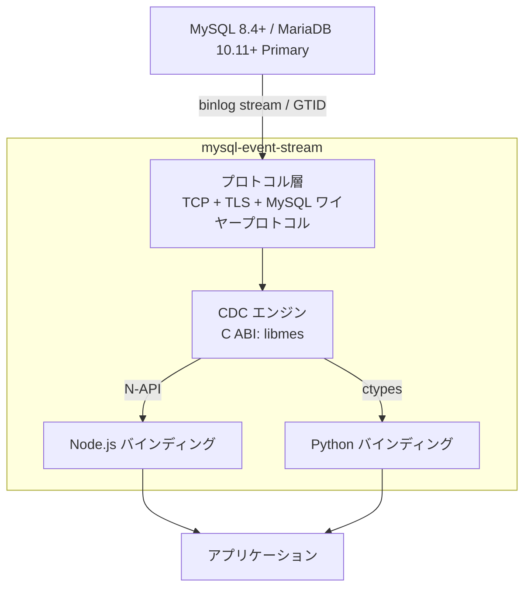

# mysql-event-stream

[](https://github.com/libraz/mysql-event-stream/actions)
[](https://github.com/libraz/mysql-event-stream/releases)
[](https://www.npmjs.com/package/@libraz/mysql-event-stream)
[](https://pypi.org/project/mysql-event-stream/)
[](https://codecov.io/gh/libraz/mysql-event-stream)
[](https://github.com/libraz/mysql-event-stream/blob/main/LICENSE)
[](https://en.cppreference.com/w/cpp/17)
[](https://dev.mysql.com/)
[](https://mariadb.org/)
[](https://github.com/libraz/mysql-event-stream)

MySQL / MariaDB の binlog レプリケーションイベントをアプリケーション向けのストリーミング API に変換する軽量ライブラリです。

[mygram-db](https://github.com/libraz/mygram-db) のレプリケーション層を独立した CDC (Change Data Capture) エンジンとして切り出したプロジェクトです。

## 概要

mysql-event-stream は MySQL 8.4+ および MariaDB 10.11+ のバイナリログイベントをパースし、行レベルの変更イベント (INSERT / UPDATE / DELETE) を構造化データとして出力します。C ABI のコアライブラリに加え、Node.js と Python のバインディングを提供しており、リアルタイムデータパイプライン、監査ログ、キャッシュ無効化、イベント駆動アーキテクチャの構築に MySQL / MariaDB のどちらからでも利用できます。

## アーキテクチャ


```mermaid
graph TD
    MySQL[MySQL 8.4+ / MariaDB 10.11+ Primary] -->|binlog stream / GTID| Proto

    subgraph mysql-event-stream
        Proto[プロトコル層\nTCP + TLS + MySQL ワイヤープロトコル] --> Core[CDC エンジン\nC ABI: libmes]
        Core -->|N-API| Node[Node.js バインディング]
        Core -->|ctypes| Python[Python バインディング]
    end

    Node --> App[アプリケーション]
    Python --> App
```

## クイックスタート

### Node.js

```typescript
import { CdcEngine } from "@libraz/mysql-event-stream";

const engine = new CdcEngine();

// レプリケーションストリームから受信した binlog バイト列を投入
engine.feed(binlogChunk);

while (engine.hasEvents()) {
  const event = engine.nextEvent();
  if (event === null) break;
  console.log(event.type, event.database, event.table);
  console.log("before:", event.before);
  console.log("after:", event.after);
}

engine.destroy();
```

### Python

```python
from mysql_event_stream import CdcEngine

engine = CdcEngine()

# binlog バイト列を投入
engine.feed(binlog_chunk)

while engine.has_events():
    event = engine.next_event()
    print(event.type, event.database, event.table)
    print("before:", event.before)
    print("after:", event.after)

engine.close()
```

### C API

```c
#include "mes.h"

mes_engine_t* engine = mes_create();
size_t consumed;
mes_feed(engine, data, len, &consumed);

const mes_event_t* event;
while (mes_next_event(engine, &event) == MES_OK) {
    printf("%s.%s: type=%d\n", event->database, event->table, event->type);
}

mes_destroy(engine);
```

### 出力例

`ChangeEvent` にはイベント種別、データベース/テーブル名、binlog 位置、カラム名をキーとした辞書形式の行データが含まれます:

```
-- INSERT INTO items (name, value) VALUES ('Widget', 42)
{
  "type": "INSERT",
  "database": "mes_test",
  "table": "items",
  "before": null,
  "after": { "id": 8, "name": "Widget", "value": 42 },
  "timestamp": 1773584163,
  "position": { "file": "mysql-bin.000003", "offset": 3265 },
  "namesResolved": true
}

-- UPDATE items SET value = 100 WHERE name = 'Widget'
{
  "type": "UPDATE",
  "database": "mes_test",
  "table": "items",
  "before": { "id": 8, "name": "Widget", "value": 42 },
  "after": { "id": 8, "name": "Widget", "value": 100 },
  "timestamp": 1773584164,
  "position": { "file": "mysql-bin.000003", "offset": 3611 },
  "namesResolved": true
}

-- DELETE FROM items WHERE name = 'Widget'
{
  "type": "DELETE",
  "database": "mes_test",
  "table": "items",
  "before": { "id": 8, "name": "Widget", "value": 100 },
  "after": null,
  "timestamp": 1773584164,
  "position": { "file": "mysql-bin.000003", "offset": 3922 }
}
```

## 特徴

- **自己完結パッケージ** - MySQL クライアントライブラリ不要。配布物は OpenSSL と zlib を静的リンク
- **ストリーミング処理** - バイト列の到着に合わせて逐次的にイベントを処理
- **多言語対応** - C/C++、Node.js (N-API)、Python (ctypes) バインディング
- **MySQL 8.4+** - LTS および Innovation リリースに対応
- **MariaDB 10.11+** - MariaDB 向け binlog プロトコル、GTID (`domain-server-seq` 形式)、ANNOTATE_ROWS SQL（`sourceSql` / `source_sql`）、slave capability ネゴシエーションに対応
- **GTID サポート** - GTID ベースのレプリケーションに対応した BinlogClient (MySQL / MariaDB 両形式)
- **行レベルイベント** - INSERT / UPDATE / DELETE の変更前後のカラム値を完全に取得
- **VECTOR 型** - MySQL 9.0+ の VECTOR カラムをネイティブサポート（生バイト列としてデコード）
- **カラム名解決** - `binlog_row_metadata=FULL` または `SELECT` 権限を持つメタデータ接続による自動カラム名解決
- **辞書形式** - 行データを `Record<string, unknown>` / `dict[str, Any]` で直感的にアクセス
- **SSL/TLS** - MySQL 接続の SSL/TLS 暗号化に対応
- **自動再接続** - 接続断時にバックオフ付きで自動再接続
- **流量制御** - 内部リーダースレッド + 上限付きイベントキュー（デフォルト10,000件）により、アプリ側の処理遅延でストリームが切断されるのを防止
- **テーブルフィルタ** - データベース・テーブル単位で取り込み対象を絞り込み
- **構造化ログ** - コールバック形式の構造化ログ出力 (event=name key=value)
- **安全な停止** - `stop()` でどのスレッドからでもストリームを停止可能。読み取り側・処理側ともに即座にブロック解除

## 設定

### SSL/TLS

```typescript
// Node.js
const stream = new CdcStream({
  host: "mysql.example.com",
  user: "replicator",
  password: "secret",
  sslMode: 4,  // 0=無効, 1=優先, 2=必須, 3=CA検証, 4=サーバー検証
  sslCa: "/path/to/ca.pem",
});
```

```python
# Python
stream = CdcStream(
    host="mysql.example.com",
    user="replicator",
    password="secret",
    ssl_mode=4,
    ssl_ca="/path/to/ca.pem",
)
```

`preferred` と `required` は暗号化しますが、サーバー証明書を検証しません。本番の認証情報には、CA バンドルまたは OS の信頼ストアとともに `verify_ca` か `verify_identity` を使ってください。

### 認証プラグイン

native client が対応する MySQL 認証プラグインは `caching_sha2_password` と
`mysql_native_password` です。これ以外をサーバーが要求した場合は、暗黙に
フォールバックせず認証エラーになります。TLS なしで
`caching_sha2_password` を使う際の RSA 公開鍵取得は
`allowPublicKeyRetrieval` / `allow_public_key_retrieval` による明示的な opt-in
です。可能な限り検証付き TLS を使ってください。

### テーブルフィルタリング

```typescript
// Node.js - 特定のテーブルのイベントのみ処理
const stream = new CdcStream({
  host: "mysql.example.com",
  includeDatabases: ["mydb"],
  excludeTables: ["mydb.audit_log"],
});
```

```python
# Python
stream = CdcStream(
    host="mysql.example.com",
    include_databases=["mydb"],
    exclude_tables=["mydb.audit_log"],
)
```

フィルタは大文字小文字を区別します。`database.table` またはテーブル名だけの完全一致に加え、
末尾の `*` を prefix ワイルドカードとして使えます（例: `mydb.audit_*`）。それ以外の位置の
`*` はリテラルです。include フィルタを設定し、TABLE_MAP を受信したにもかかわらず一件も
一致しなければ、reset または stream close 時に log callback へ
`include_filter_matched_nothing` WARN が一度だけ配送されます。MySQL の識別子の大文字小文字規則は
サーバープラットフォームで異なるため、送信元サーバーが出力する名前を使ってください。

### 流量制御

```typescript
// BinlogClient は内部にリーダースレッドと上限付きイベントキューを持つ。
// デフォルトキューサイズ: 10,000 件。
// キューが満杯になると TCP レベルで自然にサーバー側の送信が抑制される。
const stream = new CdcStream({
  maxQueueSize: 5000,  // キューサイズ（デフォルト: 10000）
});
```

### スレッド安全性

`CdcEngine` は単一のスレッドまたはタスクから使う前提です。同じインスタンスに対して
`feed()`、`nextEvent()`、`reset()`、フィルタや設定メソッドを同時に呼び出さないで
ください。並行して使う場合は、スレッドやタスクごとに別のインスタンスを作るか、
呼び出し側で排他制御してください。

`BinlogClient` / `CdcStream` は内部でリーダースレッドを使います。poll や iteration、
接続・切断などのライフサイクル操作は、1 つのスレッドまたはタスクから行ってください。
待機中の poll や iterator を止める場合は、別スレッドから安全に呼べる `stop()` を
使ってください。

### ログ

```c
// C API - 構造化ログコールバック
void my_log(mes_log_level_t level, const char* message, void* userdata) {
    fprintf(stderr, "[%d] %s\n", level, message);
    // 出力: [2] event=mysql_connected host=127.0.0.1 port=3306
}
mes_set_log_callback(my_log, MES_LOG_INFO, NULL);
```

### 自動再接続

```typescript
// Node.js - リニアバックオフ付き自動再接続 (1秒, 2秒, ... 最大10秒)
const stream = new CdcStream({
  host: "mysql.example.com",
  user: "replicator",
  maxReconnectAttempts: 10,  // デフォルト: 10, 0 = 無効
});
```

## インストール

### 前提条件

- CMake 3.20+
- C++17 コンパイラ (GCC 9+ または Clang 10+)
- OpenSSL 開発ライブラリ
- zlib 開発ライブラリ
- macOS向けビルド済みパッケージはmacOS 15.0以降（サーバー用途はLinuxを推奨）

```bash
# macOS
brew install cmake openssl zlib

# Ubuntu / Debian
sudo apt install cmake build-essential libssl-dev zlib1g-dev pkg-config

# クローン
git clone https://github.com/libraz/mysql-event-stream.git
cd mysql-event-stream
```

### C++ コア

```bash
make build
make test

# オプション: C/C++ プロジェクトから利用する場合
sudo make install
sudo make uninstall
```

### Node.js バインディング

Node.js 22+ および Yarn が必要です。

```bash
cd bindings/node
yarn install
yarn build
yarn test
```

### Python バインディング

Python 3.11+ が必要です。バインディングは [Rye](https://rye.astral.sh/) で管理しており、
開発環境の依存関係は `requirements.lock` / `requirements-dev.lock` が正になります。

```bash
cd bindings/python
rye sync
rye run pytest
```

## プロジェクト構成

```
mysql-event-stream/
  core/                        # C++ コアライブラリ
    include/mes.h              #   パブリック C ABI ヘッダ
    src/
      protocol/                #   MySQL ワイヤープロトコル (TCP, TLS, 認証, クエリ, binlog)
      client/                  #   BinlogClient, EventQueue, ConnectionValidator
    tests/                     #   ユニットテスト (Google Test)
      e2e/                     #   E2E テスト (Docker MySQL 8.4+)
  bindings/
    node/                      # Node.js バインディング (N-API アドオン)
    python/                    # Python バインディング (ctypes)
  e2e/
    docker/                    # Docker Compose + MySQL 初期化 + SSL 証明書
```

## 経緯

このプロジェクトは、MySQL レプリケーションを活用したインメモリ全文検索エンジン [mygram-db](https://github.com/libraz/mygram-db) から、binlog パースおよびレプリケーション関連のコンポーネントを抽出したものです。mygram-db が完全な検索サーバーであるのに対し、mysql-event-stream は CDC に特化しており、MySQL の変更イベントストリーミングを任意のアプリケーションに組み込むことができます。

## 要件

**MySQL:**
- バージョン: 8.4+ (LTS および Innovation リリース)
- GTID モード有効 (BinlogClient 使用時)
- レプリケーション権限: `REPLICATION SLAVE`, `REPLICATION CLIENT`
- スキーマ由来のカラム名には `binlog_row_metadata=FULL` を設定するか、同じ認証情報に `SELECT` も付与します。メタデータクエリは別接続で実行されます。
- メタデータ接続は binlog の過去時点ではなくサーバーの**現在の**スキーマを読みます。古い checkpoint から再生する場合、カラム名を信頼できるのは `binlog_row_metadata=FULL` を設定し、元の TABLE_MAP metadata を保持しているときだけです。

**MariaDB:**
- バージョン: 10.11+ (10.11 / 11.4 で動作検証済み)
- GTID レプリケーション有効 (`gtid_strict_mode`、行フォーマットの `log_bin`)
- レプリケーション権限: `REPLICATION SLAVE`, `REPLICATION CLIENT`
- スキーマ由来のカラム名には `binlog_row_metadata=FULL` を設定するか、同じ認証情報に `SELECT` も付与します。メタデータクエリは別接続で実行されます。
- メタデータ接続は binlog の過去時点ではなくサーバーの**現在の**スキーマを読みます。古い checkpoint から再生する場合、カラム名を信頼できるのは `binlog_row_metadata=FULL` を設定し、元の TABLE_MAP metadata を保持しているときだけです。
- クライアントはサーバーフレーバーを自動検出し、MariaDB binlog プロトコル（GTID イベント type 162、ANNOTATE_ROWS、`@mariadb_slave_capability`）に切り替えます

### MySQL binlog 設定

接続 validator は次の MySQL 設定を必須とします。`my.cnf`（または include
される設定ファイル）へコピーし、変更後に MySQL を再起動してください。

```ini
[mysqld]
log_bin=ON
gtid_mode=ON
binlog_format=ROW
binlog_row_image=FULL
binlog_transaction_compression=OFF
binlog_row_value_options=""
```

`binlog_row_value_options` に `PARTIAL_JSON` を含めることはできません。MariaDB
では同等の行形式を検査し、`log_bin_compress=ON` を拒否します。

## ライセンス

[Apache License 2.0](LICENSE)

## 作者

- libraz
