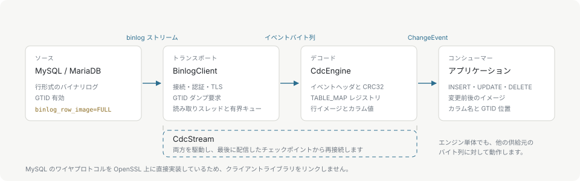

# mysql-event-stream

MySQL / MariaDB 向けの、組み込み可能な CDC エンジンです。レプリカと同じようにバイナリログを読み、行単位の変更イベントを発行します。MySQL クライアントライブラリはリンクしません。

[](https://github.com/libraz/mysql-event-stream/actions)
[](https://github.com/libraz/mysql-event-stream/releases)
[](https://www.npmjs.com/package/@libraz/mysql-event-stream)
[](https://pypi.org/project/mysql-event-stream/)
[](https://codecov.io/gh/libraz/mysql-event-stream)
[](https://github.com/libraz/mysql-event-stream/blob/main/LICENSE)
[](https://en.cppreference.com/w/cpp/17)
[](https://dev.mysql.com/)
[](https://mariadb.org/)
[](https://github.com/libraz/mysql-event-stream)



C++17 のコアが、MySQL のワイヤプロトコル（ハンドシェイク、`caching_sha2_password`、`COM_BINLOG_DUMP_GTID`）を OpenSSL 上に直接実装し、その上に binlog パーサーと行デコーダーを載せています。コアは C ABI として公開され、その上に Node.js の N-API アドオンと Python の `ctypes` パッケージが乗ります。リリース成果物は OpenSSL と zlib を静的にリンクし、ほかには何も依存しません。

## できること

```typescript
import { CdcStream } from "@libraz/mysql-event-stream";

await using stream = new CdcStream({
  host: "mysql.example.com",
  user: "replicator",
  password: process.env.MYSQL_PASSWORD,
  serverId: 1001,
  includeDatabases: ["shop"],
  startGtid: await loadCheckpoint(),
});

for await (const event of stream) {
  await handle(event); // 冪等に書く
  await saveCheckpoint(stream.currentGtid);
}
```

```python
async with CdcStream(
    host="mysql.example.com",
    user="replicator",
    password=os.environ["MYSQL_PASSWORD"],
    server_id=1001,
    include_databases=["shop"],
    start_gtid=await load_checkpoint(),
) as stream:
    async for event in stream:
        await handle(event)  # 冪等に書く
        await save_checkpoint(stream.current_gtid)
```

`UPDATE` は変更前後の両方のイメージを伴って届きます。

```json
{
  "type": "UPDATE",
  "database": "shop",
  "table": "items",
  "before": { "id": 8, "name": "Widget", "value": 42 },
  "after": { "id": 8, "name": "Widget", "value": 100 },
  "timestamp": 1773584164,
  "position": { "file": "mysql-bin.000003", "offset": 3611 },
  "namesResolved": true,
  "sourceSql": ""
}
```

多くのアプリケーションが必要とするのは `CdcStream` です。その下には、接続だけを受け持ちイベントの生バイト列を返す `BinlogClient` と、ファイル・キュー・別プロセスなど任意の供給元から来た binlog バイト列をデコードする `CdcEngine` があります。`CdcEngine` はソケットもスレッドも持ちません。渡すバイト列はイベント境界から始まっている必要があり、生の binlog ファイルは先頭 4 バイトのマジックナンバーを先に読み飛ばしてください。

## インストール

```sh
npm install @libraz/mysql-event-stream
```

```sh
pip install mysql-event-stream
```

Node.js 22 以降、Python 3.11 以降が必要です。C / C++ からは `libmes` をリンクします（[はじめかた](docs/ja/getting-started.md#ソースからのビルド)を参照）。

接続先は MySQL 8.4 以降または MariaDB 10.11 以降で、`binlog_row_image=FULL` の行形式でログを取っている必要があります。アカウントには `REPLICATION SLAVE` と `REPLICATION CLIENT` が要ります。残りは[サーバー設定](docs/ja/server-setup.md)にまとめてあります。既定値のままの 2 プロセスが衝突するレプリカ識別子の規則も、そこに書いてあります。

## ドキュメント

[はじめに](docs/ja/introduction.md)と[はじめかた](docs/ja/getting-started.md)から読み始めてください。全ページの目次は「はじめに」にあります。[実例](docs/ja/examples.md)には、再開可能なコンシューマー、キャッシュ無効化、クライアントとエンジンを手動で結線する例、記録済みストリームのオフラインデコードを載せています。

リファレンスは [C API](docs/ja/c-api.md)、[Node.js API](docs/ja/node-api.md)、[Python API](docs/ja/python-api.md) です。リリースノートは [docs/releases](docs/releases/)、要約された履歴は [CHANGELOG.md](CHANGELOG.md) にあります。

## できないこと

- **スナップショットは取りません。** 読むのはログであってテーブルではありません。既存行の初期ロードは利用側の仕事で、ストリームはその前に取得した GTID から再開します。
- **exactly-once 配信はしません。** 再接続後にイベントが再配信されることがあります。チェックポイントは自分の処理が成功してから保存し、その処理は冪等に書いてください。
- **DDL イベントは出しません。** スキーマ文は変更イベントとして現れません。
- **過去のスキーマは分かりません。** メタデータ接続で解決したカラム名は、現在のスキーマを表します。再生には `binlog_row_metadata=FULL` を使ってください。この場合はカラム名がイベント自体に載ってきます。
- **文字コード変換はしません。** テキストカラムは UTF-8 としてデコードします。ほかの文字集合で格納されたデータは変換されません。

## 経緯

MySQL レプリケーションを備えたインメモリ全文検索エンジン [mygram-db](https://github.com/libraz/mygram-db) の binlog 解析・レプリケーション層を、独立したエンジンとして切り出したものです。mygram-db は検索サーバーですが、こちらはその CDC 部分だけを、どこにでも組み込める形に整えています。

## ライセンス

[Apache-2.0](LICENSE)
