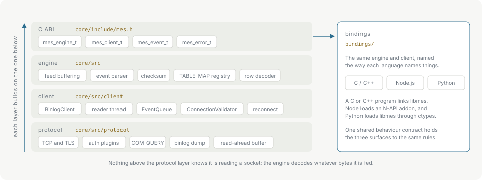

# Architecture

## No client library

The MySQL wire protocol is implemented directly on OpenSSL: the handshake, capability negotiation, `caching_sha2_password` and `mysql_native_password`, `COM_QUERY`, `COM_BINLOG_DUMP` and `COM_BINLOG_DUMP_GTID`. Linking a client library would undo the reason the project exists — a release artifact carries OpenSSL and zlib statically and depends on nothing else.

## Protocol

`core/src/protocol` owns the socket. TCP with configurable connect and read timeouts, TLS through OpenSSL, packet framing, authentication, and the two commands the layers above send: a query and a binlog dump request.

A read-ahead buffer sits in front of the socket. Binlog packets arrive small, and at those sizes buffering is worth 36× over reading the socket directly; see [Performance](performance.md).

Nothing above this layer knows it is reading a socket.

## Client

`core/src/client` owns a connection's lifetime. `ConnectionValidator` checks the server's configuration before any events flow and refuses a source that would decode incorrectly. `BinlogClient` negotiates the dump, runs a reader thread, and pushes events into a bounded `EventQueue` the consumer drains. See [Backpressure and limits](backpressure.md).

The client does not decode. What it hands back is one event's raw bytes plus the framing they were read under — which matters, because a `FORMAT_DESCRIPTION_EVENT` changes that framing while events read under the previous one are still queued.

## Engine

`core/src` owns decoding. It buffers a partial byte stream across feeds, parses event headers, verifies CRC32 trailers where the framing says there is one, keeps the `TABLE_MAP` registry that gives later row events their column layout, and decodes row images into typed column values. Filters are applied here, before a dropped event is decoded.

The engine has no network and no thread of its own. It decodes whatever bytes it is fed, which is what makes replay and offline decoding the same code path as live streaming.

## C ABI

`core/include/mes.h` is the published surface: `mes_engine_t`, `mes_client_t`, `mes_event_t`, `mes_error_t`, and the functions over them. `mes_abi_version()` reports the ABI generation, and `mes_sizeof_event()` / `mes_sizeof_column()` let a binding check the struct sizes it was compiled against.

Two invariants a binding author will otherwise get wrong:

- `mes_engine_t` and `mes_client_t` are not thread-safe, with eight exceptions on `mes_client_t`: `mes_client_stop()` and the observers `mes_client_is_connected()`, `mes_client_is_streaming()`, `mes_client_checksum_enabled()`, `mes_client_queued_bytes()`, `mes_client_crc_errors()`, `mes_client_last_error()` and `mes_client_current_gtid()`, all callable from another thread. See the [C API](c-api.md#invariants).
- Event pointers from `mes_next_event()` are valid only until the next `mes_feed()`, `mes_next_event()` or `mes_reset()`, and `mes_client_poll()` data only until the next poll.

Additions are laid out so that a binary built against an older header keeps linking and running; the reverse is what the ABI version refuses.

## Bindings

`bindings/node` is an N-API addon over the same C ABI; `bindings/python` loads `libmes` through `ctypes`. Neither reimplements any part of the protocol or the decoder.

The two surfaces are held to one shared behaviour contract — the same class names, the same option semantics under each language's naming convention, the same error codes, the same lifecycle rules — and cross-binding tests compare them against it, so a fix in one does not quietly leave the other behind.

## Error codes

One numeric space spans every layer, partitioned by range: parse errors in the 100s, decode in the 200s, state in the 300s, connection in the 400s. A caller branches on the number rather than on which layer produced it. See [Errors](errors.md).
