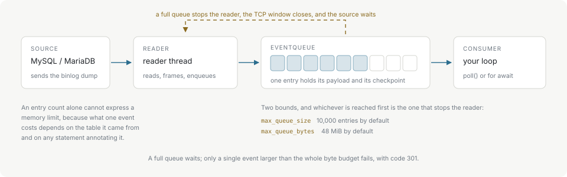

# Backpressure and limits

A consumer slower than the source is the normal case, not the exception. The client absorbs the difference in a bounded queue instead of buffering without limit or dropping the connection.



A reader thread pulls events off the socket and enqueues them; the consumer drains the queue from its own thread or task. When the queue is full the reader stops reading, the TCP receive window closes, and the source waits. Nothing is discarded and nothing grows unbounded.

## The two bounds

| Option | Default | What it counts |
| --- | --- | --- |
| `maxQueueSize` / `max_queue_size` | 10,000 entries | Queued events. |
| `maxQueueBytes` / `max_queue_bytes` | 48 MiB | Bytes those events hold. |

Whichever is reached first stops the reader. `0` restores the default for either.

An entry count alone cannot express a memory limit, because what one queued event costs depends on the table it came from and on any statement annotating it. Measured across a range of schemas, one queued row event holds between 241 bytes and 10.7 KB — a forty-fold spread — so the entry count binds only while an event stays under roughly 5 KB. [Performance](performance.md) has the per-schema figures.

The byte budget charges each queued wire payload plus the GTID checkpoint held with it, so a source with a wide GTID set applies backpressure after fewer events than a narrow one.

## Event size

`maxEventSize` / `max_event_size` bounds a single binlog event for both the client and the parser. The default is 32 MiB; `0` resolves to the 1 GiB hard cap.

Raise `maxQueueBytes` alongside it. An event larger than the whole byte budget can never be queued, and that is the one queue condition that fails rather than waits: the connection is retired and the poll reports code 301 with `Binlog event exceeds max_queue_bytes`.

## On the engine

`CdcEngine` carries the same two bounds with the same defaults, and `feed()` is where they show. A feed stops early once the queue is full and returns how many bytes it consumed, which is why the feed loop drains and re-feeds the tail:

```typescript
let offset = 0;
while (offset < chunk.length) {
  const consumed = engine.feed(chunk.subarray(offset));
  offset += consumed;
  for (let e = engine.nextEvent(); e !== null; e = engine.nextEvent()) handle(e);
  if (consumed === 0) break; // partial event at the tail
}
```

A `consumed` of zero with an empty queue means the tail is an incomplete event. Keep those bytes and prepend them to the next chunk. Never re-feed from offset zero: the engine already holds the partial event, and replaying the bytes corrupts its state.

## Query result caps

The queries the client runs on the side — configuration validation, GTID lookup, column metadata — are capped at 100,000 retained rows and 64 MiB. These are compile-time constants with no configuration knob. Exceeding one fails with code 301 and closes the connection, so reconnect before querying again.
