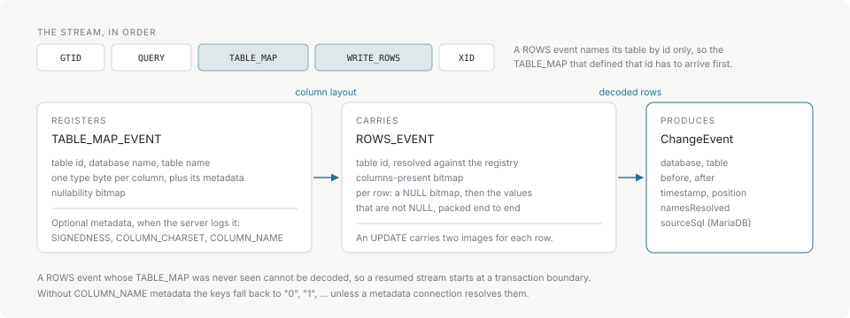

# Change events

A `ChangeEvent` describes one row that changed. A statement touching fifty rows produces fifty events, each carrying the images of its own row.

## Fields

| Node.js | Python | Meaning |
| --- | --- | --- |
| `type` | `type` | `"INSERT"`, `"UPDATE"` or `"DELETE"`. |
| `database` | `database` | Database the row lives in. |
| `table` | `table` | Table the row lives in. |
| `before` | `before` | The row as it was. `null` / `None` for an `INSERT`. |
| `after` | `after` | The row as it is. `null` / `None` for a `DELETE`. |
| `timestamp` | `timestamp` | Unix seconds from the event header — when the source wrote the event, not when it was read. |
| `position` | `position` | Binlog file and offset the event was read from. |
| `namesResolved` | `names_resolved` | False when any column name for this table could not be resolved. |
| `sourceSql` | `source_sql` | The statement that produced the event, from MariaDB's `ANNOTATE_ROWS`. Empty otherwise. |

`before` and `after` are plain records keyed by column name — `Record<string, ColumnValue>` in Node, `dict[str, Any]` in Python. [Column values](column-values.md) has the type mapping. When names could not be resolved the keys are the numeric indices `"0"`, `"1"`, `"2"` as strings, and `namesResolved` is false; see [Column names](column-names.md).

```json
{
  "type": "UPDATE",
  "database": "shop",
  "table": "items",
  "before": { "id": 8, "name": "Widget", "value": 42 },
  "after": { "id": 8, "name": "Widget", "value": 100 },
  "timestamp": 1773584164,
  "position": { "file": "mysql-bin.000003", "offset": 3611 },
  "namesResolved": true
}
```

## How a row event becomes one

Row data in a binlog is not self-describing. The `ROWS_EVENT` names its table by a numeric id and packs the values end to end with no types attached; everything needed to read those bytes came earlier, in a `TABLE_MAP_EVENT`.



Two consequences follow from that shape.

A `ROWS_EVENT` whose `TABLE_MAP` was never seen cannot be decoded at all. This is why a resumed stream starts at a transaction boundary, and why `reset()` on an engine clears the table registry along with the buffered bytes.

What the `TABLE_MAP` carries decides how much of the row is readable. The type bytes are always there; signedness, charsets and column names are optional metadata the server logs only when `binlog_row_metadata` asks it to. Without charset metadata, a character column and a binary column share one type byte, so both are decoded as bytes — the only reading that cannot be wrong.

## Ordering and delivery

Events arrive in binlog order, which is commit order on the source. Within one statement they arrive in the order the rows were written.

Delivery is at-least-once. A reconnect resumes from the last checkpoint the consumer committed, and any event after that point is delivered again. See [Checkpoints and recovery](checkpoints.md).

## Pointer lifetime

This matters to C callers and to anyone writing a new binding. An event returned by `mes_next_event()` is valid only until the next `mes_feed()`, `mes_next_event()` or `mes_reset()` on that engine, and `mes_client_poll()` data only until the next poll. Copy anything that has to outlive the call.

The Node and Python bindings already copy, so a `ChangeEvent` from either one is an ordinary value with no lifetime attached.
