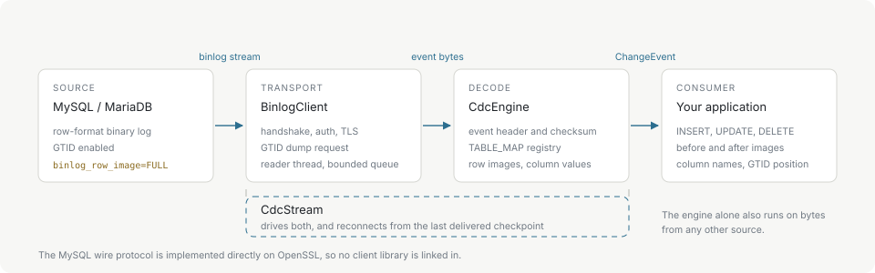
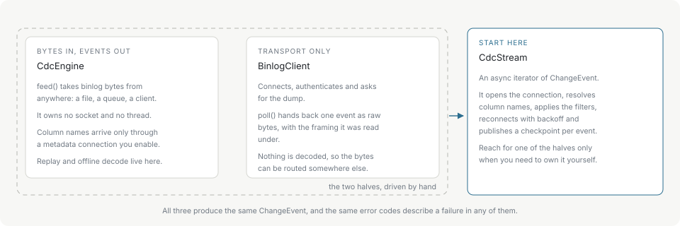

# Introduction

mysql-event-stream turns a MySQL or MariaDB binary log into row-level change events. A committed `INSERT`, `UPDATE` or `DELETE` arrives as a `ChangeEvent` carrying the table it happened in, the row before the change, the row after it, and the position in the log where it sits.

The library registers with the source as a replica and reads the same stream a real replica would. It does not poll tables, compare snapshots, or require triggers, and it adds nothing to the schema.

## What is in the box

A C++17 core implements the MySQL wire protocol directly on OpenSSL — handshake, capability negotiation, `caching_sha2_password` and native authentication, `COM_QUERY`, `COM_BINLOG_DUMP_GTID` — and the binlog parser and row decoder above it. No client library is linked in, which is the reason the project exists: the release artifacts carry OpenSSL and zlib statically and nothing else.

That core is published through a C ABI, and two bindings sit on it: a Node.js N-API addon and a Python `ctypes` package. A C or C++ program links `libmes` and uses the same entry points the bindings do.

## The three surfaces

Every binding exposes the same three objects. Which one to use depends on how much of the machinery you want to own.

`CdcStream` is the one to start with. It opens the connection, resolves column names, applies the table filters, reconnects with backoff after a transport failure, and publishes a checkpoint for each delivered event. Iterating it yields `ChangeEvent` values.

`BinlogClient` owns the connection and nothing else. `poll()` returns one event's raw bytes together with the framing they were read under. Use it when the bytes are going somewhere other than straight into a decoder — a queue, a file, another process.

`CdcEngine` decodes. `feed()` takes binlog bytes from any source and `nextEvent()` drains the decoded events. It opens no socket and starts no thread, so it is also what a replay tool or an offline decoder is built on.

All three produce the same `ChangeEvent`, and a failure in any of them is described by the same numeric error code.

## What it does not do

- **No snapshot.** The library reads the log; it does not read tables. An initial load of existing rows is the application's job, and the [checkpoint](checkpoints.md) taken before that load is what the stream resumes from.
- **No exactly-once delivery.** An event can be redelivered after a reconnect. Persist a checkpoint only after your own processing of that event succeeded, and make the processing idempotent.
- **No DDL events.** Schema statements are not surfaced as change events. `ANNOTATE_ROWS` on MariaDB carries the statement text that produced a row event, and that is a different thing — see [MariaDB](mariadb.md).
- **No historical schema.** Column names resolved through a metadata connection describe the schema as it is now, not as it was at the position being decoded. See [Column names](column-names.md).
- **No transcoding.** Text columns are decoded as UTF-8. Data stored in another character set is not converted. See [Column values](column-values.md).

## The rest of the documentation

Start with [Getting started](getting-started.md), which installs the package and runs the first stream, and [Server setup](server-setup.md), which covers what the source has to be configured for before any of it works. [Examples](examples.md) has the worked shapes.

**Working with events**

- [Change events](change-events.md) — the fields, and how a row event becomes one.
- [Column values](column-values.md) — what each MySQL type arrives as.
- [Column names](column-names.md) — the two routes to real keys, and when each is safe.
- [Table filtering](filtering.md) — dropping events before they are decoded.

**Running a stream**

- [Checkpoints and recovery](checkpoints.md) — resuming, reconnecting, and the first snapshot.
- [Backpressure and limits](backpressure.md) — queue bounds and event size.
- [Threading and lifecycle](threading.md) — who may call what, from where.
- [TLS and authentication](tls-and-authentication.md) — SSL modes and `caching_sha2_password`.
- [Logging](logging.md) — the structured log callback.
- [Errors](errors.md) — the codes, and which ones to retry.

**Reference**

- [Architecture](architecture.md) — the layers and what each one owns.
- [MariaDB](mariadb.md) — where a MariaDB source differs.
- [Performance](performance.md) — measured throughput, scaling and memory.
- [C API](c-api.md) · [Node.js API](node-api.md) · [Python API](python-api.md)
- [Glossary](glossary.md)
