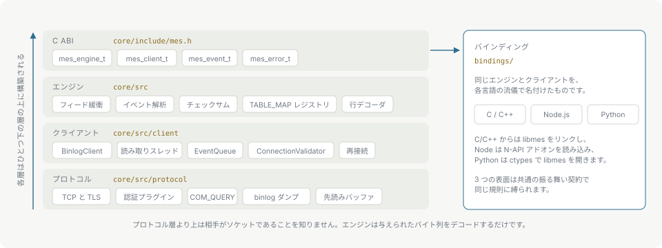

# アーキテクチャ

## クライアントライブラリを使わない

MySQL のワイヤプロトコルは OpenSSL の上に直接実装しています。ハンドシェイク、capability negotiation、`caching_sha2_password` と `mysql_native_password`、`COM_QUERY`、`COM_BINLOG_DUMP` と `COM_BINLOG_DUMP_GTID` です。クライアントライブラリをリンクすれば、このプロジェクトが存在する理由が失われます。リリース成果物は OpenSSL と zlib を静的に取り込み、それ以外には何も依存しません。

## プロトコル

`core/src/protocol` がソケットを受け持ちます。接続タイムアウトと読み取りタイムアウトを設定できる TCP、OpenSSL による TLS、パケットのフレーミング、認証、そして上位のレイヤーが送る 2 つのコマンド、つまりクエリと binlog dump 要求です。

ソケットの手前には先読みバッファがあります。binlog のパケットは小さく届き、そのサイズではソケットを直接読むより 36 倍速くなります。[パフォーマンス](performance.md)を参照してください。

このレイヤーより上は、ソケットを読んでいることを知りません。

## クライアント

`core/src/client` が接続の生存期間を受け持ちます。`ConnectionValidator` はイベントが流れ始める前にサーバーの設定を検査し、正しくデコードできないソースを拒否します。`BinlogClient` は dump をネゴシエートし、リーダースレッドを動かし、コンシューマーが読み出す上限付きの `EventQueue` にイベントを積みます。[バックプレッシャーと上限](backpressure.md)を参照してください。

クライアントはデコードしません。返すのは 1 イベント分の生のバイト列と、それを読み取ったときのフレーミングです。フレーミングを併せて返すのは、`FORMAT_DESCRIPTION_EVENT` がフレーミングを変えても、前のフレーミングで読まれたイベントがまだキューに残っているからです。

## エンジン

`core/src` がデコードを受け持ちます。複数回の feed にまたがる部分バイト列をバッファし、イベントヘッダを解析し、フレーミングが CRC32 トレーラありと示す場合はそれを検証し、後続の row イベントにカラムのレイアウトを与える `TABLE_MAP` レジストリを保持し、row イメージを型付きのカラム値へデコードします。フィルタはここで、捨てるイベントをデコードする前に適用します。

エンジンはネットワークも自前のスレッドも持ちません。渡されたバイト列をデコードするだけであり、だからこそリプレイもオフラインデコードも、ライブのストリーミングと同じコードパスを通ります。

## C ABI

`core/include/mes.h` が公開する表面です。`mes_engine_t`、`mes_client_t`、`mes_event_t`、`mes_error_t` と、それらを扱う関数です。`mes_abi_version()` は ABI の世代を返し、`mes_sizeof_event()` / `mes_sizeof_column()` を使うと、バインディングはコンパイル時に前提とした構造体サイズを確認できます。

バインディングの作者が、明記しなければ取り違える不変条件が 2 つあります。

- `mes_engine_t` と `mes_client_t` はスレッドセーフではありません。ただし `mes_client_t` には 8 つの例外があり、`mes_client_stop()` と、オブザーバ群の `mes_client_is_connected()`、`mes_client_is_streaming()`、`mes_client_checksum_enabled()`、`mes_client_queued_bytes()`、`mes_client_crc_errors()`、`mes_client_last_error()`、`mes_client_current_gtid()` はいずれも別スレッドから呼べます。[C API](c-api.md#不変条件)を参照してください。
- `mes_next_event()` が返すイベントポインタは、次の `mes_feed()`、`mes_next_event()`、`mes_reset()` までしか有効ではなく、`mes_client_poll()` のデータは次の poll までしか有効ではありません。

追加は、古いヘッダでビルドされたバイナリがそのままリンクして動き続けるように配置します。逆向きは ABI バージョンが拒否します。

## バインディング

`bindings/node` は同じ C ABI の上に載る N-API アドオンで、`bindings/python` は `ctypes` で `libmes` を読み込みます。どちらもプロトコルやデコーダを作り直してはいません。

2 つの表面は 1 つの共有された振る舞いの契約に従います。同じクラス名、各言語の命名規則に沿った同じオプションの意味、同じエラーコード、同じライフサイクル規則です。クロスバインディングのテストが両者をこの契約と突き合わせるので、片方の修正がもう片方に入らないまま残ることはありません。

## エラーコード

1 つの数値空間があらゆるレイヤーにまたがり、範囲で区切られています。パースエラーは 100 番台、デコードは 200 番台、状態は 300 番台、接続は 400 番台です。呼び出し側は、どのレイヤーが出したかではなく番号で分岐します。[エラー](errors.md)を参照してください。
