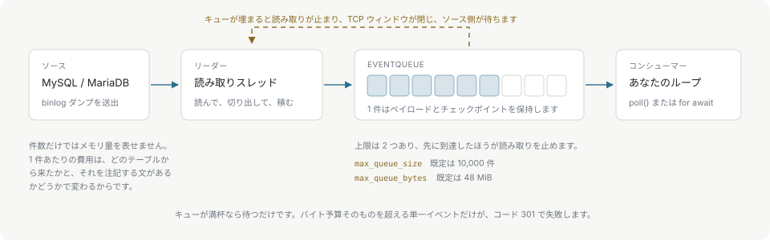

# バックプレッシャーと上限

取得元より消費側が遅いのは普通のことです。クライアントはその差を上限付きのキューで吸収します。無制限にバッファすることも、接続を切ることもしません。



リーダースレッドがソケットからイベントを取り出してキューに積み、消費側は自分のスレッドまたはタスクからキューを空にしていきます。キューが埋まるとリーダーは読み取りを止め、TCP の受信ウィンドウが閉じ、取得元が待ちます。捨てられるものはなく、無制限に増えるものもありません。

## 2 つの上限

| オプション | 既定値 | 数えるもの |
| --- | --- | --- |
| `maxQueueSize` / `max_queue_size` | 10,000 件 | キューに入ったイベント数。 |
| `maxQueueBytes` / `max_queue_bytes` | 48 MiB | そのイベントが占めるバイト数。 |

先に到達した方がリーダーを止めます。どちらも `0` を指定すると既定値に戻ります。

件数だけではメモリの上限を表せません。キューに入ったイベント 1 件のコストは、取得元のテーブルと、そこに付く注釈文によって変わるからです。いくつかのスキーマで測ると、キュー上の行イベント 1 件が占めるのは 241 バイトから 10.7 KB までで、40 倍の開きがあります。そのため件数が上限として効くのは、1 件がおよそ 5 KB を超えない間だけです。スキーマごとの数値は[パフォーマンス](performance.md)にあります。

バイト予算は、キューに入った各ワイヤペイロードと、それと一緒に保持する GTID チェックポイントを数えます。そのため、GTID セットの広い取得元では、狭い取得元より少ないイベント数でバックプレッシャーが掛かります。

## イベントサイズ

`maxEventSize` / `max_event_size` は、クライアントとパーサーの両方で binlog イベント 1 件に上限を掛けます。`BinlogClient` / `CdcStream` の既定は 32 MiB、単体の `CdcEngine` の既定は 64 MiB です。`0` はどちらの既定にも戻さず、1 GiB のハード上限まで引き上げます。

上げるときは `maxQueueBytes` も一緒に上げてください。バイト予算の全体より大きいイベントはキューに入れられません。キューの条件のうち、待たずに失敗するのはこれだけです。接続は破棄され、poll は `Binlog event exceeds max_queue_bytes` を伴うコード 301 を返します。

## エンジンでの扱い

`CdcEngine` も同じ 2 つの上限を同じ既定値で持ち、それが現れるのは `feed()` です。キューが埋まると feed は途中で止まり、消費したバイト数を返します。feed のループがキューを空にしてから残りを送り直すのは、このためです。

```typescript
let offset = 0;
while (offset < chunk.length || engine.hasEvents()) {
  for (let e = engine.nextEvent(); e !== null; e = engine.nextEvent()) handle(e);
  if (offset < chunk.length) {
    const consumed = engine.feed(chunk.subarray(offset));
    offset += consumed;
    if (consumed === 0 && !engine.hasEvents()) break; // 末尾に不完全なイベントが残っている
  }
}
```

キューが空の状態で `consumed` が 0 なら、末尾は不完全なイベントです。両者を見分けるのは、先にキューを空にしてから判定するからで、キューが満杯であっても 1 回の `feed()` は 0 を返すことがあります。そのバイト列を保持し、次のチャンクの先頭に付けてください。オフセット 0 から送り直してはいけません。エンジンは不完全なイベントをすでに保持しているので、同じバイト列を送ると状態が壊れます。

## クエリ結果の上限

クライアントが裏で実行するクエリ——設定の検証、GTID の取得、カラムのメタデータ——は、保持する行数 100,000 件と 64 MiB で頭打ちになります。これらはコンパイル時の定数で、設定の項目はありません。どちらかを超えるとコード 301 で失敗し、接続が閉じます。もう一度クエリを実行する前に接続し直してください。
