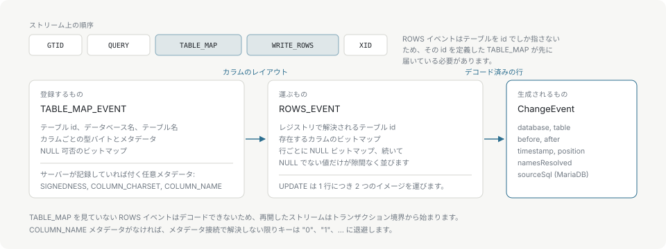

# 変更イベント

`ChangeEvent` は変更された 1 行を表します。50 行に触れるステートメントは 50 個のイベントを生み、それぞれが自分の行のイメージを持ちます。

## フィールド

| Node.js | Python | 意味 |
| --- | --- | --- |
| `type` | `type` | Node: 文字列 `"INSERT"`、`"UPDATE"`、`"DELETE"` のいずれか。Python: `EventType` enum のメンバー `EventType.INSERT`、`EventType.UPDATE`、`EventType.DELETE` のいずれかです。比較は文字列ではなく enum のメンバーと `==` で行います。 |
| `database` | `database` | 行が属するデータベース。 |
| `table` | `table` | 行が属するテーブル。 |
| `before` | `before` | 変更前の行。`INSERT` では `null` / `None`。 |
| `after` | `after` | 変更後の行。`DELETE` では `null` / `None`。 |
| `timestamp` | `timestamp` | イベントヘッダの Unix 秒。読み取った時刻ではなく、ソースがイベントを書いた時刻。 |
| `position` | `position` | イベントを読み取った binlog のファイルとオフセット。 |
| `namesResolved` | `names_resolved` | このテーブルのカラム名を 1 つでも解決できなかったときは false。 |
| `sourceSql` | `source_sql` | MariaDB の `ANNOTATE_ROWS` から得た、イベントを生んだステートメント。それ以外では空。 |

`before` と `after` はカラム名をキーにした素のレコードで、Node では `Record<string, ColumnValue>`、Python では `dict[str, Any]` です。型の対応は[カラム値](column-values.md)にあります。名前を解決できなかった場合、キーは `"0"`、`"1"`、`"2"` という数値インデックスの文字列になり、`namesResolved` は false になります。[カラム名](column-names.md)を参照してください。

```json
{
  "type": "UPDATE",
  "database": "shop",
  "table": "items",
  "before": { "id": 8, "name": "Widget", "value": 42 },
  "after": { "id": 8, "name": "Widget", "value": 100 },
  "timestamp": 1773584164,
  "position": { "file": "mysql-bin.000003", "offset": 3611 },
  "namesResolved": true
}
```

## row イベントが ChangeEvent になるまで

binlog の行データは自己記述的ではありません。`ROWS_EVENT` はテーブルを数値 id で指し、値を型なしで端から端まで詰めます。そのバイト列を読むのに必要なものは、すべてそれより前の `TABLE_MAP_EVENT` で届いています。



この形から 2 つの帰結が出ます。

`TABLE_MAP` を一度も見ていない `ROWS_EVENT` は、そもそもデコードできません。再開したストリームがトランザクション境界から始まるのはこのためで、エンジンの `reset()` がバッファ済みのバイト列と一緒にテーブルレジストリを消すのもこのためです。

`TABLE_MAP` が何を運ぶかで、行のどこまでが読めるかが決まります。型バイトは常にありますが、符号の有無、charset、カラム名は任意のメタデータで、`binlog_row_metadata` が求めたときだけサーバーが記録します。charset のメタデータがないと、文字カラムとバイナリカラムは 1 つの型バイトを共有するため、どちらもバイト列としてデコードされます。これが唯一、誤りようのない読み方です。

## 順序と配送

イベントは binlog の順序、つまりソース上のコミット順で届きます。1 つのステートメントの中では、行が書かれた順に届きます。

配送は at-least-once です。再接続するとコンシューマーがコミットした最後のチェックポイントから再開するので、その地点より後のイベントは再び配送されます。[チェックポイントと復旧](checkpoints.md)を参照してください。

## ポインタの生存期間

ここは C から呼ぶ側と、新しいバインディングを書く側に関わります。`mes_next_event()` が返したイベントは、そのエンジンに対する次の `mes_feed()`、`mes_next_event()`、`mes_reset()` までしか有効ではなく、`mes_client_poll()` のデータは次の poll までしか有効ではありません。呼び出しをまたいで残すものはコピーしてください。

Node と Python のバインディングはすでにコピーしているので、どちらから受け取った `ChangeEvent` も、生存期間の付かない普通の値です。
