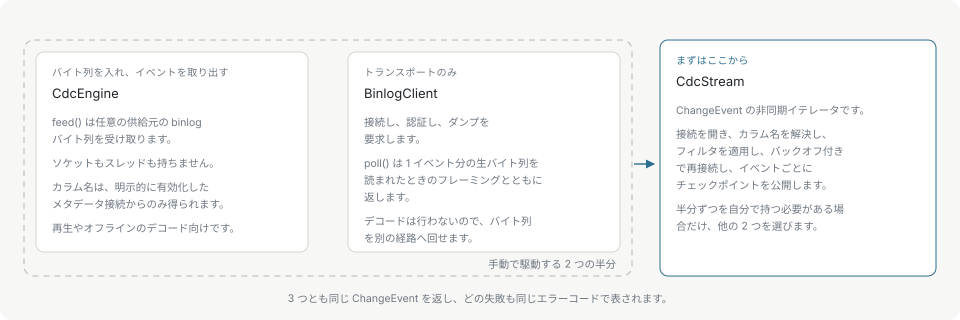

# はじめに

mysql-event-stream は、MySQL や MariaDB のバイナリログを行単位の変更イベントに変換します。コミットされた `INSERT`、`UPDATE`、`DELETE` は `ChangeEvent` として届き、発生したテーブル、変更前の行、変更後の行、そしてログ上の位置を持ちます。

このライブラリはレプリカとしてソースに登録し、実際のレプリカが読むのと同じストリームを読みます。テーブルをポーリングせず、スナップショットを比較せず、トリガーも必要とせず、スキーマには何も足しません。

## 中身

C++17 のコアが、MySQL のワイヤプロトコルを OpenSSL の上に直接実装しています。ハンドシェイク、ケイパビリティ交渉、`caching_sha2_password` とネイティブ認証、`COM_QUERY`、`COM_BINLOG_DUMP_GTID`、そしてその上に載る binlog パーサと行デコーダです。クライアントライブラリは一切リンクしません。それがこのプロジェクトの存在理由で、リリース成果物が静的に抱えるのは OpenSSL と zlib だけです。

このコアは C ABI として公開され、その上に 2 つのバインディングが載ります。Node.js の N-API アドオンと、Python の `ctypes` パッケージです。C や C++ のプログラムは `libmes` をリンクして、バインディングと同じエントリポイントを使います。

## 3 つの表面

どのバインディングも同じ 3 つのオブジェクトを公開します。どれを使うかは、仕組みのどこまでを自分で持つかで決まります。

まず使うのは `CdcStream` です。接続を開き、カラム名を解決し、テーブルフィルタを適用し、転送が失敗したらバックオフしながら再接続し、配信したイベントごとにチェックポイントを公開します。反復すると `ChangeEvent` が得られます。

`BinlogClient` が持つのは接続だけです。`poll()` は 1 イベント分の生バイト列を、それを読んだときのフレーミングと一緒に返します。バイト列をデコーダへ直接渡すのではなく、キューやファイル、別のプロセスへ送る場合に使います。

`CdcEngine` はデコードを担当します。`feed()` が任意の入手元から binlog のバイト列を受け取り、`nextEvent()` がデコード済みのイベントを取り出します。ソケットを開かずスレッドも起動しないので、リプレイツールやオフラインデコーダの土台にもなります。

3 つとも同じ `ChangeEvent` を生成し、どれで失敗しても同じ数値の error code で表されます。

## しないこと

- **スナップショットなし**。読むのはログであって、テーブルではありません。既存の行の初期ロードはアプリケーション側の仕事で、そのロードの前に取った[チェックポイント](checkpoints.md)がストリームの再開点になります。
- **exactly-once 配信なし**。再接続のあとにイベントが再配信されることがあります。チェックポイントを永続化するのは、そのイベントの処理が成功したあとだけにして、処理は冪等にします。
- **DDL イベントなし**。スキーマ文は変更イベントとしては出てきません。MariaDB の `ANNOTATE_ROWS` は行イベントを生んだ文のテキストを運びますが、それは別のものです。[MariaDB](mariadb.md)を参照してください。
- **過去のスキーマなし**。メタデータ接続で解決したカラム名が表すのは現在のスキーマで、デコード中の位置にあった当時のスキーマではありません。[カラム名](column-names.md)を参照してください。
- **文字コード変換なし**。テキストカラムは UTF-8 としてデコードします。別の文字セットで格納されたデータは変換しません。[カラム値](column-values.md)を参照してください。

## このドキュメントの構成

まず [はじめかた](getting-started.md)でパッケージを入れて最初のストリームを動かし、[サーバー設定](server-setup.md)で、その前提としてソースに必要な設定を確認します。[実例](examples.md)には実際の形が並んでいます。

**イベントを扱う**

- [変更イベント](change-events.md) — フィールドと、行イベントがイベントになるまで。
- [カラム値](column-values.md) — MySQL の各型が何として届くか。
- [カラム名](column-names.md) — 実際のキーを得る 2 つの経路と、それぞれが安全な条件。
- [テーブルフィルタ](filtering.md) — デコードの前にイベントを捨てる。

**ストリームを動かす**

- [チェックポイントと復旧](checkpoints.md) — 再開、再接続、最初のスナップショット。
- [バックプレッシャーと上限](backpressure.md) — キューの境界とイベントサイズ。
- [スレッドとライフサイクル](threading.md) — どこから何を呼べるか。
- [TLS と認証](tls-and-authentication.md) — SSL モードと `caching_sha2_password`。
- [ロギング](logging.md) — 構造化ログのコールバック。
- [エラー](errors.md) — コードと、再試行してよいもの。

**リファレンス**

- [アーキテクチャ](architecture.md) — レイヤと、それぞれが持つもの。
- [MariaDB](mariadb.md) — MariaDB をソースにしたときの違い。
- [パフォーマンス](performance.md) — 実測のスループット、スケーリング、メモリ。
- [C API](c-api.md) · [Node.js API](node-api.md) · [Python API](python-api.md)
- [用語集](glossary.md)
